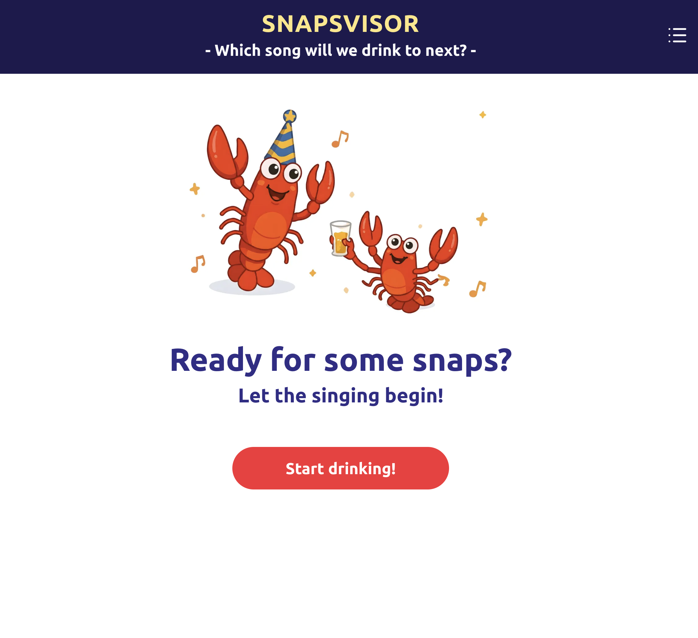
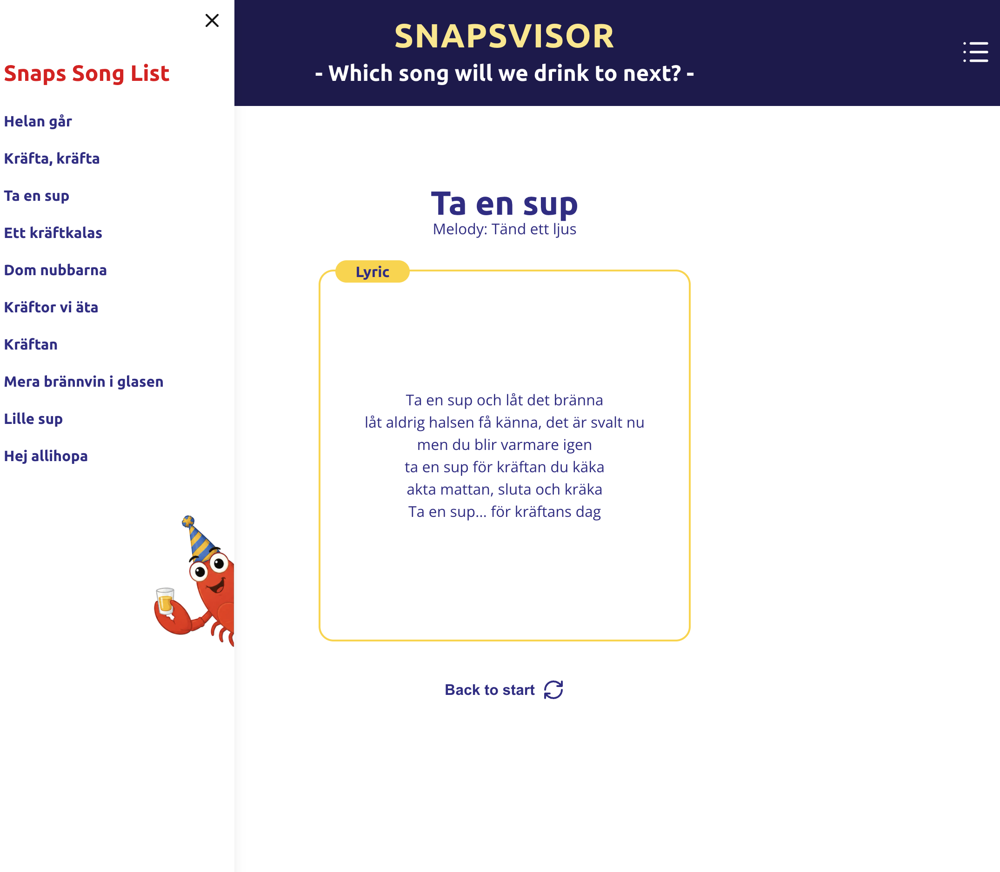
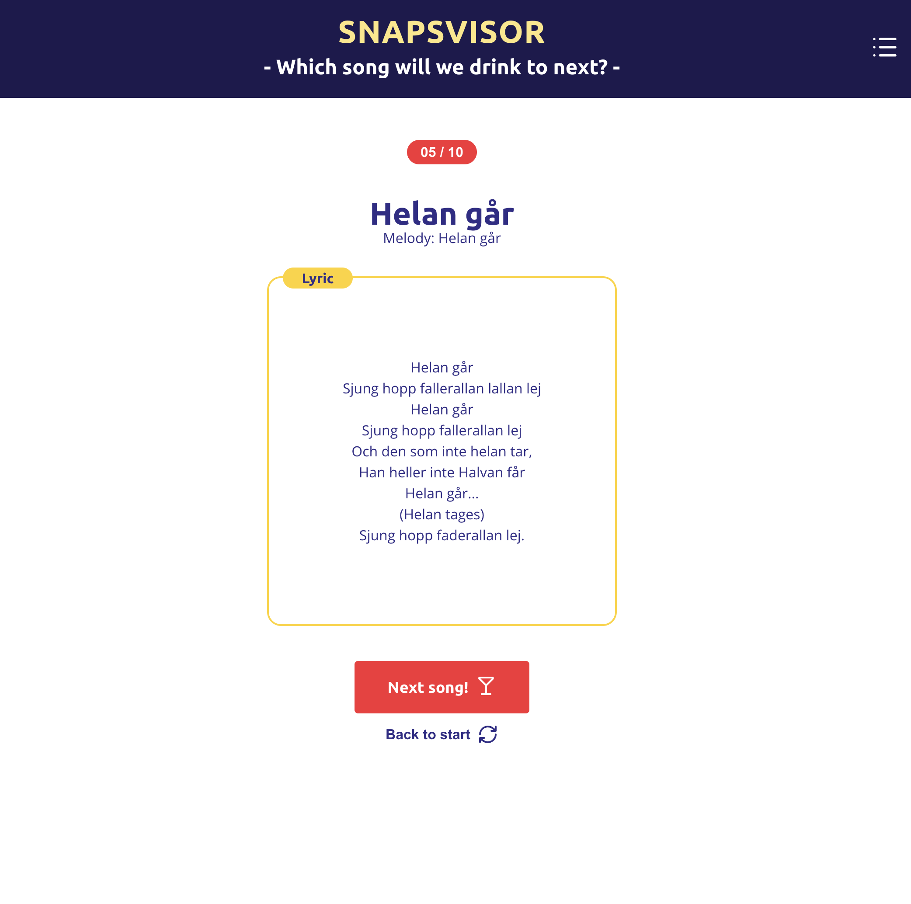

# Snapsvisor

**Snapsvisor** is a dedicated song database created for the traditional Swedish crayfish party (_kräftskiva_).

Have you ever found yourself peeling crayfish, wondering which drinking song to sing next? With our built-in **Randomizer feature**, you can instantly pick the next song with a single click—keeping the festive momentum going without missing a beat! In addition, the intuitive sidebar allows guests to effortlessly browse and read the full lyrics for every traditional tune.

Bring it along to your next crayfish party and elevate your snaps singing experience. _Skål!_

# Features

1. **Song Database & Sidebar Navigation**:

- Easily browse and select traditional snapsvisor from a dedicated sidebar to view full lyrics and melodies.

2. **One-Click Randomizer**:

- Instantly suggests a random snapsvisa for the table when users can't decide what to sing next.
  

3. **Lyrics View & Details**:

- Clear, readable display of lyrics tailored for quick reading during celebrations.

# User flow

`Start screen
↓
Start drinking!
↓
Random song selected
↓
Song + Lyrics
↓
Next song
↓
Another unused song
↓
...
↓
All songs have been displayed
↓
"Drunk already?"
↓
Back to start
↓
Start screen`

The user can also press Back to start at any time during the session.
